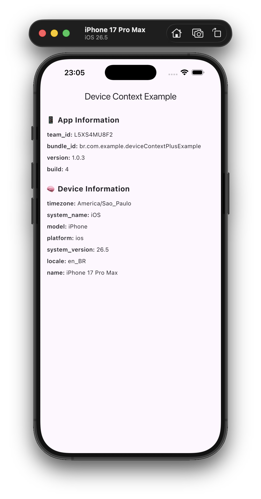
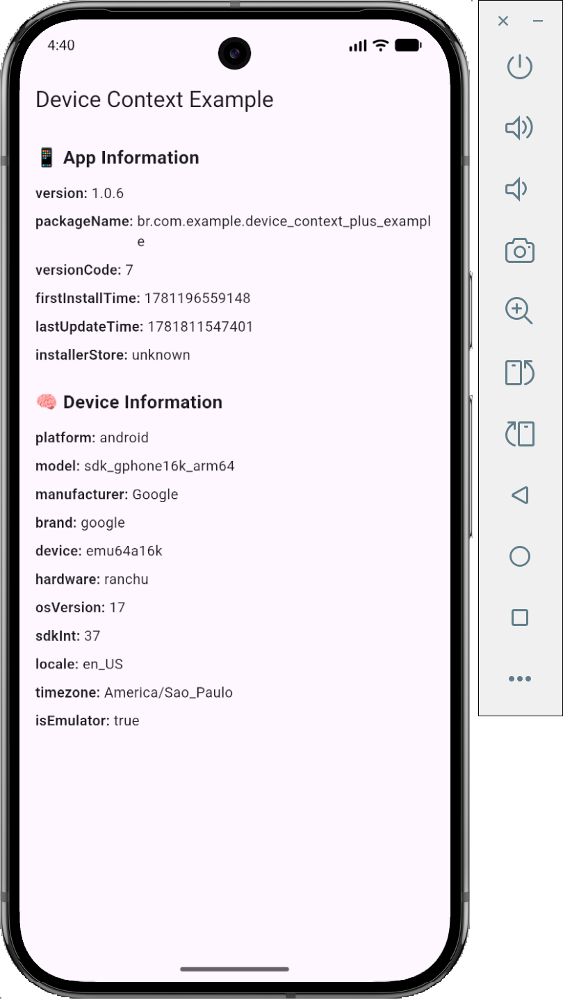

# device_context_plus

[](https://pub.dev/packages/device_context_plus)
[](https://pub.dev/packages/device_context_plus/score)
[](https://pub.dev/packages/device_context_plus/score)
[](https://pub.dev/packages/device_context_plus/score)

[](https://buymeacoffee.com/malexandrej)

A Flutter plugin that provides **enhanced device and application context** for analytics, debugging, and runtime insights.

Unlike basic plugins, `device_context_plus` goes beyond simple app info by exposing structured system data such as:

- ✅ iOS Team ID (unique feature)
- ✅ Android installer source (Play Store, APK, etc.)
- ✅ Device and OS information
- ✅ Locale and timezone
- ✅ Structured and typed API

---

## 📱 Example

| 🍎 → iOS / Apple                              | 🤖 → Android                                          |
| --------------------------------------------- | ----------------------------------------------------- |
|  |  |

> Example app showing device and app context including iOS Team ID.

---

## ✨ Features

- 📱 App information (version, build, bundle id)
- 🍎 iOS Team ID support
- 🤖 Android installer source
- 🧠 Device system details (model, OS, manufacturer)
- 🌍 Locale and timezone
- 🧩 Structured data (`app`, `device`)
- 🧱 Strongly-typed model (`DeviceContext`)

---

## 🛠️ Usage

```dart
// Get full context
final context = await DeviceContextPlus.getContext();
print(context.app);
print(context.device);

// Or fetch individually
final app = await DeviceContextPlus.getApp();
final device = await DeviceContextPlus.getDevice();
```

### Available Methods

| Method         | Returns                    |
| -------------- | -------------------------- |
| `getContext()` | Structured `DeviceContext` |
| `getApp()`     | Application information    |
| `getDevice()`  | Device and OS information  |

### Example Response

```json
{
  "app": {
    "bundle_id": "com.example.deviceContextPlusExample",
    "version": "1.0.0",
    "build": "1",
    "team_id": "G5VS9WO7F1"
  },
  "device": {
    "platform": "ios",
    "model": "iPhone",
    "name": "iPhone 17 Pro Max",
    "system_name": "iOS",
    "system_version": "26.5",
    "locale": "en_BR",
    "timezone": "America/Sao_Paulo"
  }
}
```

---

## 🧠 Data Structure

### 📱 App

| Field       | Description                          |
| ----------- | ------------------------------------ |
| `bundle_id` | App identifier                       |
| `version`   | App version                          |
| `build`     | Build number                         |
| `team_id`   | Apple Developer Team ID _(iOS only)_ |

### 📟 Device

| Field            | Description        |
| ---------------- | ------------------ |
| `platform`       | `android` or `ios` |
| `model`          | Device model       |
| `name`           | Device name        |
| `system_name`    | OS name            |
| `system_version` | OS version         |
| `locale`         | Device locale      |
| `timezone`       | Device timezone    |

## 🚀 Getting Started

Add the plugin to your `pubspec.yaml`:

```yaml
dependencies:
  device_context_plus: ^1.0.0
```
